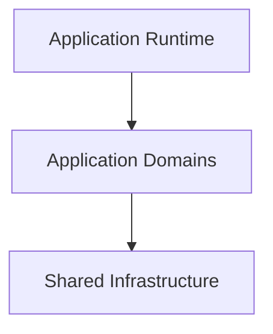

# Application Structure

## Status

Legacy

---

# Purpose

This document describes the physical structure of the legacy KJVOnly application.

It explains how the application is organized, how its major responsibilities are separated, and how the various implementation layers work together to form the complete application.

The application described by this document is the fully functioning implementation that existed when the architecture specification was completed.

It serves as the baseline implementation from which the target architecture will evolve.

This document intentionally describes the implementation rather than the architecture.

---

# Scope

This document describes:

- the physical repository structure,
- the organization of the client application,
- the major implementation layers,
- the relationship between application domains and shared infrastructure,
- and the runtime composition of the application.

This document does not describe:

- resource discovery,
- resource loading,
- persistence,
- synchronization,
- startup,
- workers,
- or individual domain implementations.

Those responsibilities are described by their own implementation documents.

---

# Background

The KJVOnly application was originally developed as an offline-first Progressive Web Application (PWA).

The application initially distributed app-provided resources as statically hosted files while storing all application data locally within the browser.

As the application evolved, support for Nostr was introduced to replace static distribution with decentralized resource discovery and publishing while preserving the application's existing behavior and offline-first design.

Rather than redesigning the application around Nostr, Nostr was introduced as another infrastructure layer responsible for transporting application resources.

The application itself continued to operate on its existing Domain Objects and local storage model.

This separation allowed the application's user-facing behavior to remain largely unchanged while the underlying distribution model evolved.

---

# Big Takeaway

The legacy application is organized around application domains hosted within a persistent single-page runtime.

The application is not organized around routes.

Instead, a single application shell hosts a dynamic workspace that manages panes, buffers, and domain modules.

Shared infrastructure provides services to those domains but does not define the structure of the application.

This separation allows application behavior to remain focused on domains while infrastructure concerns such as storage, synchronization, workers, and Nostr integration remain largely independent.

---

# High-Level Organization

The application consists of three primary layers.



The application runtime is responsible for presenting and managing the user interface.

Application domains implement the behavior visible to users.

Shared infrastructure provides reusable technical capabilities used by one or more domains.

Each layer has a distinct responsibility.

The application runtime composes the user experience.

Domains implement application behavior.

Infrastructure supports the domains without becoming part of the application's public behavior.

---

# Repository Structure

The repository contains several projects that together form the complete application.

At a high level the client application is isolated from supporting services such as the relay, Blossom server, deployment assets, and tooling.

```text
client/
relay/
blossom/
docs/
zarf/
```

The implementation described throughout this guide refers primarily to the client application located under:

```text
client/src/
```

The remaining projects exist to support development, testing, deployment, and resource distribution.

---

# Client Structure

The client application is implemented as a SvelteKit single-page application.

Most implementation code resides under:

```text
client/src/lib/
```

The library is organized around application domains supported by a set of shared technical packages.

```text
lib/

components/
models/
modules/
nostr/
services/
storer/
utils/
workers/
```

Each directory has a clearly defined responsibility.

| Directory | Responsibility |
|-----------|----------------|
| `components/` | Reusable user interface components shared between domains. |
| `models/` | Application Domain Objects and supporting types. |
| `modules/` | Domain-specific user interface and application behavior. |
| `nostr/` | Nostr protocol integration, relay communication, publishing, and event retrieval. |
| `services/` | Shared application and domain services. |
| `storer/` | IndexedDB persistence and local storage abstractions. |
| `utils/` | Shared utility functions used throughout the application. |
| `workers/` | Background processing including synchronization, downloading, indexing, and long-running operations. |

This organization separates reusable technical infrastructure from the application's domains while allowing domains to remain the primary organizational concept throughout the application.