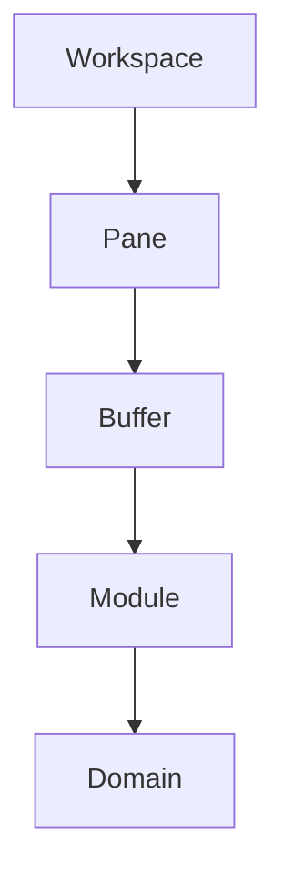
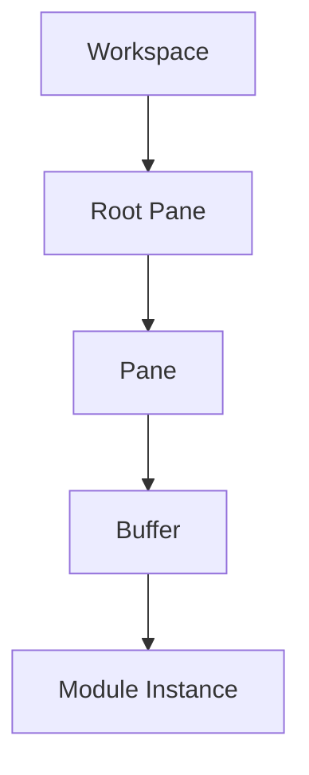
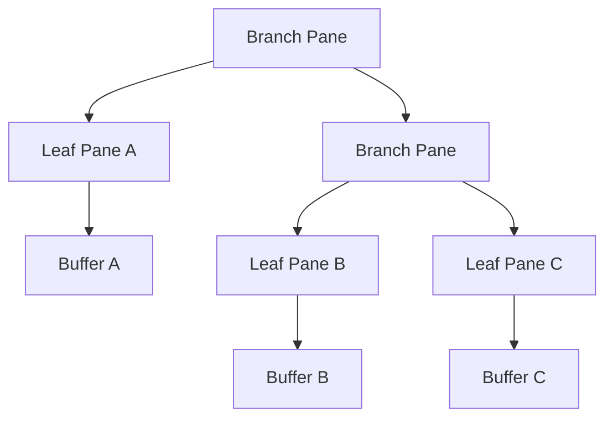

# Workspace Runtime

## Status

Current

---

# Purpose

The Workspace Runtime is responsible for presenting and coordinating the visible application.

It provides the runtime environment in which modules execute, user interaction occurs, and the workspace evolves over time.

This document describes the conceptual runtime model.

It intentionally describes the runtime independently from its current implementation.

Although the current implementation primarily resides within the application's root route, the concepts described by this document are independent of any particular framework, component hierarchy, or source file organization.

---

# Scope

This document defines:

- the responsibilities of the Workspace Runtime,
- the runtime object model,
- the workspace model,
- pane trees,
- buffers,
- modules,
- workspace operations,
- and the relationships between these concepts.

It does not describe the detailed rendering implementation, framework-specific behavior, or source code organization.

Those topics are described by implementation-specific documents.

---

# Background

Unlike traditional web applications, the KJVOnly application does not organize user interaction around route navigation.

Instead, the application maintains a persistent workspace that remains active for the lifetime of the application.

The workspace behaves more like the runtime of a desktop application than a collection of independent web pages.

User interaction occurs by modifying the workspace rather than navigating between routes.

This allows multiple application modules to coexist simultaneously while preserving their independent runtime state.

The Workspace Runtime exists to coordinate this behavior.

---

# Responsibilities

The Workspace Runtime owns:

- the workspace,
- pane management,
- buffer management,
- workspace layout,
- module composition,
- workspace events,
- and runtime object coordination.

It is responsible for presenting the application.

It does not own application data.

It does not own resource distribution.

It does not understand Domain Objects.

Instead, it provides the environment in which application modules execute.

---

# High-Level Design

The Workspace Runtime is organized around a small collection of runtime objects.

Each object owns a single responsibility.



The Workspace owns the pane hierarchy.

Panes organize the visible layout.

Buffers host module instances.

Modules provide user interaction.

Domains provide application behavior.

Together these runtime objects define the visible application.

# Runtime Objects

The Workspace Runtime is composed from a small collection of Runtime Objects.

Runtime Objects describe the execution state of the application.

Unlike Domain Objects, which represent application data, Runtime Objects represent how the application is currently organized and presented.

The primary Runtime Objects are:

- Workspace
- Pane
- Buffer
- Module Instance

Conceptually:


Each Runtime Object owns a single responsibility.

Together they define the visible application independently from the application's Domain Objects and the Resource Architecture.

---

# Workspace

A Workspace is the root Runtime Object of the application.

It owns the complete visible application presented to the user.

Conceptually, a Workspace consists of:

- a root pane,
- the recursive pane tree,
- every buffer,
- every module instance,
- and the runtime state required to coordinate them.

Conceptually:

```text
Workspace

    Root Pane

        Recursive Pane Tree

            Buffers

                Module Instances
```

The current implementation realizes this model primarily through the application's root route and the root pane.

The Workspace itself is currently an implicit concept rather than a dedicated object.

This does not change the runtime model.

Future implementations may introduce a concrete `Workspace` object without changing the responsibilities described by this document.

---

# Runtime State

The Workspace owns the runtime state required to present the application.

Examples include:

- the pane hierarchy,
- buffer assignments,
- module instances,
- workspace layout,
- active selections,
- and other presentation state.

Runtime state is intentionally separate from Domain Objects.

Domain Objects describe the application's data.

Runtime state describes how that data is currently being presented to the user.

Both models are required by the application but serve different responsibilities.

---

# Runtime Persistence

Runtime state may be persisted independently from application Resources.

Persisting runtime state allows the application to restore the user's working environment following:

- a page refresh,
- the application being suspended,
- switching to another application,
- or restarting the browser.

Examples of persisted runtime state include:

- pane layout,
- buffer state,
- the last Bible location,
- selected Bible version,
- theme,
- dark mode,
- and other application preferences.

This information represents the user's working environment rather than application content.

It is therefore distinct from the Resource Architecture and does not become a Published Resource.

---

# Planned Evolution

The runtime model intentionally supports multiple independent Workspaces.

Each Workspace owns its own complete runtime object graph.

Conceptually:

```text
Workspace A

    Root Pane

        Pane Tree


Workspace B

    Root Pane

        Pane Tree


Workspace C

    Root Pane

        Pane Tree
```

Supporting multiple Workspaces enables capabilities such as:

- switching between study sessions,
- saving workspace snapshots,
- restoring previous research,
- maintaining independent study contexts,
- and resuming work exactly where it was left.

These capabilities require no fundamental changes to the runtime model.

They represent natural extensions of the existing Workspace abstraction rather than new architectural concepts.

# Panes

A Pane is a node within the Workspace pane tree.

Panes define how the visible workspace is divided.

Every Workspace owns one root Pane. All other Panes are reachable recursively through that root.

The Pane structure is independent of the modules displayed within it.

A Pane does not understand Bible chapters, notes, search results, reading plans, or other application behavior.

It understands only:

* its position within the tree,
* whether it divides into child Panes,
* the direction of that division,
* and the Buffer hosted by a leaf Pane.

This separation allows the same Pane model to host any current or future Module.

---

# Pane Types

There are two conceptual Pane types:

* Branch Pane
* Leaf Pane

## Branch Pane

A Branch Pane divides its available area between two child Panes.

It contains:

* a left child Pane,
* a right child Pane,
* and a split direction.

A Branch Pane does not directly host a Buffer.

Its responsibility is to define the relationship between its child Panes.

Conceptually:

```text
Branch Pane

    Left Pane

    Right Pane
```

The terms `left` and `right` describe the two child positions in the tree.

Their visual arrangement is determined by the Branch Pane's split direction.

Depending on that direction, the children may appear beside one another or above and below one another.

## Leaf Pane

A Leaf Pane represents one visible region of the Workspace.

It contains:

* a stable Pane identifier,
* and one Buffer.

The Buffer determines which Module Instance is presented within the Pane.

Conceptually:

```text
Leaf Pane

    Buffer

        Module Instance
```

Only Leaf Panes are directly rendered as visible application regions.

---

# Recursive Pane Tree

Branch and Leaf Panes form a recursive tree.

A Branch Pane may contain:

* two Leaf Panes,
* two Branch Panes,
* or one Branch Pane and one Leaf Pane.

This allows the Workspace to represent nested layouts of arbitrary depth.

For example:



The tree is the logical Workspace layout.

The visual layout is derived from this tree.

The rendering technology does not define the Workspace structure; it presents the structure already described by the Pane tree.

---

# Pane Runtime Object

The current Pane runtime object is represented by a recursive interface.

```typescript
export interface Pane {
  id: string | any;
  left: Pane | any;
  right: Pane | any;
  split: string | any;
  buffer: any;
  updateBuffer: Function | any;
  toggle: boolean | any;
}
```

The same interface currently represents both Branch and Leaf Panes.

A Branch Pane is identified by its child Panes and split direction.

A Leaf Pane is identified by its Pane identifier and Buffer.

Conceptually:

| Property | Branch Pane | Leaf Pane |
| -------- | ----------: | --------: |
| `id`     |          No |       Yes |
| `left`   |         Yes |        No |
| `right`  |         Yes |        No |
| `split`  |         Yes |        No |
| `buffer` |          No |       Yes |

Some current properties support the rendering implementation rather than the conceptual Pane model.

Future refactoring may introduce more precise runtime types without changing the recursive Pane-tree architecture.

For example, Branch and Leaf Panes could eventually be represented as distinct types.

The ownership and responsibilities would remain the same.

---

# Pane Identity

Every Leaf Pane has a stable identifier.

Pane identifiers allow the Workspace Runtime to:

* find a Pane,
* update its Buffer,
* split it,
* delete it,
* associate it with a rendered region,
* and preserve its identity across layout changes.

Stable identity is essential because changing the surrounding Workspace should not recreate unaffected Pane components.

A Pane may change its size or position while continuing to represent the same active Module Instance.

For example, splitting a neighboring Pane may change the available area of an existing Bible Pane.

The Bible Module should remain mounted with its current state intact.

Its chapter, scroll position, selection state, and Buffer state should not be reset merely because the Workspace layout changed.

Pane identity allows layout to evolve independently from Module identity.

---

# Pane Data and Pane Component

The Pane runtime object and the Pane component are separate concepts.

The **Pane runtime object** is a node in the recursive Workspace model.

It describes:

* tree relationships,
* split direction,
* Pane identity,
* and Buffer assignment.

The **Pane component** presents a Leaf Pane in the user interface.

It is responsible for:

* applying the Pane's current dimensions,
* resolving the Module associated with its Buffer,
* and rendering that Module Instance.

Conceptually:

```text
Pane Runtime Object
        ↓
Pane Component
        ↓
Buffer
        ↓
Module Instance
```

The runtime object belongs to the Workspace model.

The component belongs to the rendering implementation.

Keeping these responsibilities separate allows the Workspace model to remain independent from the framework used to render it.

---

# Pane Operations

The Workspace Runtime modifies the application through operations on the Pane tree.

The primary Pane operations are:

* finding a Pane,
* splitting a Pane,
* replacing a Pane's Buffer,
* and deleting a Pane.

These operations modify runtime state rather than application data.

## Find

A Pane is located recursively from the root Pane using its stable identifier.

Finding a Pane allows other Workspace operations to target one specific region without requiring knowledge of the entire rendered layout.

## Split

Splitting a Leaf Pane converts it into a Branch Pane.

The existing Pane state becomes one child.

A new Leaf Pane and Buffer become the other child.

Conceptually:

```text
Before

Leaf Pane A
    Buffer A
```

```text
After

Branch Pane
    Left: Leaf Pane A
        Buffer A

    Right: Leaf Pane B
        Buffer B
```

The existing Buffer is preserved.

The split introduces a new Pane without recreating the Module Instance already hosted by the original Pane.

## Replace Buffer

Replacing a Buffer changes the Module Instance displayed by an existing Leaf Pane without changing the surrounding Pane tree.

The Pane retains its position and identity while presenting a different application feature.

## Delete

Deleting a Leaf Pane removes it from the tree.

Its sibling replaces the parent Branch Pane so the remaining tree stays valid.

The Workspace then reorganizes itself around the remaining Panes.

Conceptually:

```text
Before

Branch Pane
    Leaf Pane A
    Leaf Pane B
```

```text
Delete Pane B
```

```text
After

Leaf Pane A
```

Deletion affects the targeted Pane and the minimum surrounding tree structure required to close the gap.

Unrelated Panes and Module Instances remain intact.

---

# Pane Responsibility

A Pane owns one structural responsibility:

> A Pane defines one node in the visible Workspace hierarchy.

A Pane does not own:

* Module behavior,
* Domain Objects,
* application services,
* resource loading,
* persistence,
* synchronization,
* or publishing.

A Leaf Pane hosts a Buffer.

A Branch Pane organizes child Panes.

The Workspace Runtime owns operations across the complete Pane tree.
