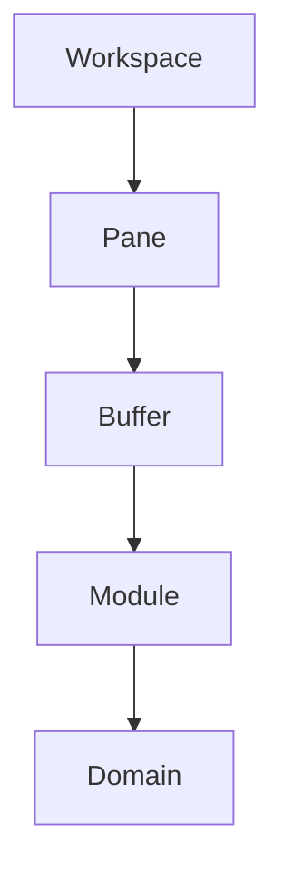
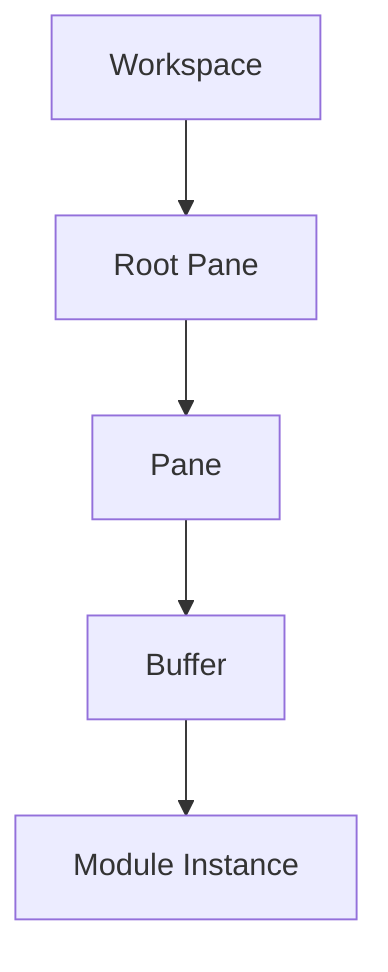

# Workspace Runtime

## Status

Current

---

# Purpose

The Workspace Runtime is responsible for presenting and coordinating the visible application.

It provides the runtime environment in which modules execute, user interaction occurs, and the workspace evolves over time.

This document describes the conceptual runtime model.

It intentionally describes the runtime independently from its current implementation.

Although the current implementation primarily resides within the application's root route, the concepts described by this document are independent of any particular framework, component hierarchy, or source file organization.

---

# Scope

This document defines:

- the responsibilities of the Workspace Runtime,
- the runtime object model,
- the workspace model,
- pane trees,
- buffers,
- modules,
- workspace operations,
- and the relationships between these concepts.

It does not describe the detailed rendering implementation, framework-specific behavior, or source code organization.

Those topics are described by implementation-specific documents.

---

# Background

Unlike traditional web applications, the KJVOnly application does not organize user interaction around route navigation.

Instead, the application maintains a persistent workspace that remains active for the lifetime of the application.

The workspace behaves more like the runtime of a desktop application than a collection of independent web pages.

User interaction occurs by modifying the workspace rather than navigating between routes.

This allows multiple application modules to coexist simultaneously while preserving their independent runtime state.

The Workspace Runtime exists to coordinate this behavior.

---

# Responsibilities

The Workspace Runtime owns:

- the workspace,
- pane management,
- buffer management,
- workspace layout,
- module composition,
- workspace events,
- and runtime object coordination.

It is responsible for presenting the application.

It does not own application data.

It does not own resource distribution.

It does not understand Domain Objects.

Instead, it provides the environment in which application modules execute.

---

# High-Level Design

The Workspace Runtime is organized around a small collection of runtime objects.

Each object owns a single responsibility.



The Workspace owns the pane hierarchy.

Panes organize the visible layout.

Buffers host module instances.

Modules provide user interaction.

Domains provide application behavior.

Together these runtime objects define the visible application.

# Runtime Objects

The Workspace Runtime is composed from a small collection of Runtime Objects.

Runtime Objects describe the execution state of the application.

Unlike Domain Objects, which represent application data, Runtime Objects represent how the application is currently organized and presented.

The primary Runtime Objects are:

- Workspace
- Pane
- Buffer
- Module Instance

Conceptually:


Each Runtime Object owns a single responsibility.

Together they define the visible application independently from the application's Domain Objects and the Resource Architecture.

---

# Workspace

A Workspace is the root Runtime Object of the application.

It owns the complete visible application presented to the user.

Conceptually, a Workspace consists of:

- a root pane,
- the recursive pane tree,
- every buffer,
- every module instance,
- and the runtime state required to coordinate them.

Conceptually:

```text
Workspace

    Root Pane

        Recursive Pane Tree

            Buffers

                Module Instances
```

The current implementation realizes this model primarily through the application's root route and the root pane.

The Workspace itself is currently an implicit concept rather than a dedicated object.

This does not change the runtime model.

Future implementations may introduce a concrete `Workspace` object without changing the responsibilities described by this document.

---

# Runtime State

The Workspace owns the runtime state required to present the application.

Examples include:

- the pane hierarchy,
- buffer assignments,
- module instances,
- workspace layout,
- active selections,
- and other presentation state.

Runtime state is intentionally separate from Domain Objects.

Domain Objects describe the application's data.

Runtime state describes how that data is currently being presented to the user.

Both models are required by the application but serve different responsibilities.

---

# Runtime Persistence

Runtime state may be persisted independently from application Resources.

Persisting runtime state allows the application to restore the user's working environment following:

- a page refresh,
- the application being suspended,
- switching to another application,
- or restarting the browser.

Examples of persisted runtime state include:

- pane layout,
- buffer state,
- the last Bible location,
- selected Bible version,
- theme,
- dark mode,
- and other application preferences.

This information represents the user's working environment rather than application content.

It is therefore distinct from the Resource Architecture and does not become a Published Resource.

---

# Planned Evolution

The runtime model intentionally supports multiple independent Workspaces.

Each Workspace owns its own complete runtime object graph.

Conceptually:

```text
Workspace A

    Root Pane

        Pane Tree


Workspace B

    Root Pane

        Pane Tree


Workspace C

    Root Pane

        Pane Tree
```

Supporting multiple Workspaces enables capabilities such as:

- switching between study sessions,
- saving workspace snapshots,
- restoring previous research,
- maintaining independent study contexts,
- and resuming work exactly where it was left.

These capabilities require no fundamental changes to the runtime model.

They represent natural extensions of the existing Workspace abstraction rather than new architectural concepts.